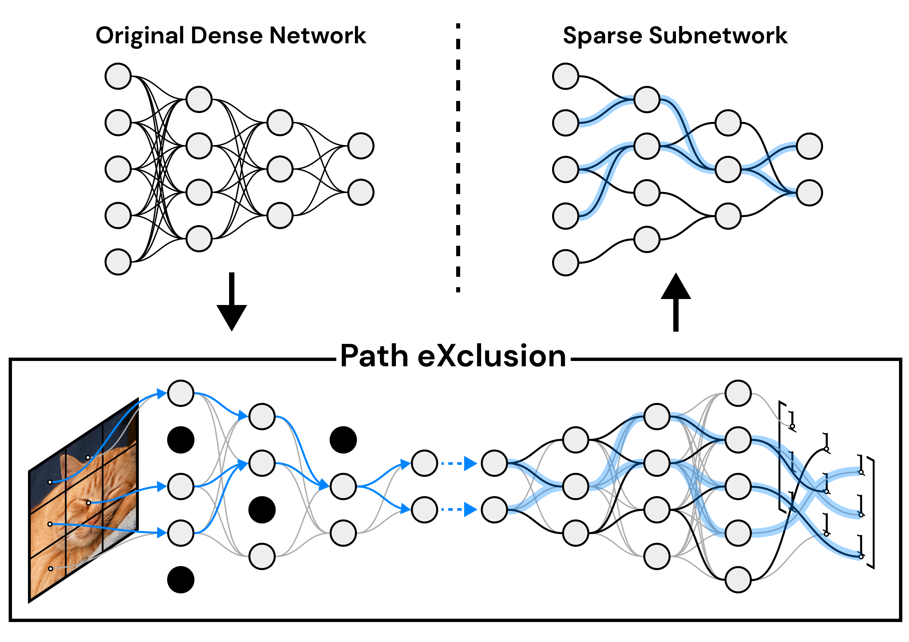

# Finding Lottery Tickets in Vision Models via Data-driven Spectral Foresight Pruning [CVPR 2024]
Official code of our work "Finding Lottery Tickets in Vision Models via Data-driven Spectral Foresight Pruning" accepted at CVPR 2024.

<p align="center"></p>

## Introduction
<i>Recent advances in neural network pruning have shown how it is possible to reduce the computational costs and memory demands of deep learning models before training. We focus on this framework and propose a new pruning at initialization algorithm that leverages the Neural Tangent Kernel (NTK) theory to align the training dynamics of the sparse network with that of the dense one. Specifically, we show how the usually neglected data-dependent component in the NTK's spectrum can be taken into account by providing an analytical upper bound to the NTK's trace obtained by decomposing neural networks into individual paths. This leads to our Path eXclusion (PX), a foresight pruning method designed to preserve the parameters that mostly influence the NTK's trace. PX is able to find lottery tickets (i.e. good paths) even at high sparsity levels and largely reduces the need for additional training. When applied to pre-trained models it extracts subnetworks directly usable for several downstream tasks, resulting in performance comparable to those of the dense counterpart but with substantial cost and computational savings.</i>

# Setting up the environment
### Requirements
Make sure to have a CUDA capable device, running at learst CUDA 11.7. Throughout our experiments we used Python version 3.10.9

### General Dependencies
To install all the required dependencies go to the root folder of this project and run:
```bash
pip install -r requirements.txt
```

### Datasets
1. CIFAR-10, CIFAR-100 and Tiny-ImageNet datasets will be downloaded automatically to the folder specified by the `CONFIG.dataset_args['root']` argument once you run the experiments.
2. ImageNet needs to be downloaded from the official website `https://www.image-net.org/`.
3. Pascal VOC2012 can be downloaded by running the following script:
```python
import os
import tarfile
from torchvision.datasets.utils import download_url

db = {'2012': {
        'url': 'http://host.robots.ox.ac.uk/pascal/VOC/voc2012/VOCtrainval_11-May-2012.tar',
        'filename': 'VOCtrainval_11-May-2012.tar',
        'md5': '6cd6e144f989b92b3379bac3b3de84fd',
        'base_dir': 'VOCdevkit/VOC2012'
    }}

def download_extract(url, root, filename, md5):
    download_url(url, root, filename, md5)
    with tarfile.open(os.path.join(root, filename), "r") as tar:
        tar.extractall(path=root)

if __name__ == '__main__':
    download_extract(db['2012']['url'], 'data/VOC2012', db['2012']['filename'], db['2012']['md5'])
```

At this point you should be able to run the provided code.

## Running The Experiments
Please refer to the `parse_args.py` file for the full list of command line arguments available. You can find in the `launch_scripts/` folder some example scripts used to run the experiments.

## Acknowledgement
Our code is developed starting from the [Synflow](https://arxiv.org/abs/2006.05467) code repository: https://github.com/ganguli-lab/Synaptic-Flow.

# Citation
```
@inproceedings{iurada2024finding,
  author={Iurada, Leonardo and Ciccone, Marco and Tommasi, Tatiana},
  booktitle={CVPR}, 
  title={Finding Lottery Tickets in Vision Models via Data-driven Spectral Foresight Pruning}, 
  year={2024}
}
```